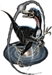

.. VELOCIraptor documentation master file, created by
   sphinx-quickstart on Mon Jul 31 10:13:40 2017.
   You can adapt this file completely to your liking, but it should at least
   contain the root `toctree` directive.

VELOCIraptor
============

|vr| is a C++ halo finder using MPI and OpenMP APIs.
The repository also contains several associated analysis tools in python,
example configuration files and analysis python scripts (and sample jupyter notebooks).
The code can also be compiled as a library for on-the-fly halo finding within an
N-body/hydrodynamnical code. Currently integration is limited to `SWIFTSIM <http://icc.dur.ac.uk/swift/>`_
but extensions are in the works for other codes.

There is an associated halo merger tree code `TreeFrog <https://www.github.com/pelahi/TreeFrog/>`_ (also C++ MPI+OpenMP).

If you are using |vr| please cite the following paper, which describe the code in full::

  @ARTICLE{doi:10.1017/pasa.2019.12,
    author = {{Elahi}, Pascal J. and {Ca{\~n}as}, Rodrigo and {Poulton}, Rhys J.~J. and {Tobar}, Rodrigo J. and {Willis}, James S. and {Lagos}, Claudia del P. and {Power}, Chris and {Robotham}, Aaron S.~G.},
    title = {Hunting for galaxies and halos in simulations with VELOCIraptor},
    journal = {\pasa},
    keywords = {dark matter, galaxies: evolution, galaxies: halos, methods: numerical, Astrophysics -Cosmology and Nongalactic Astrophysics},
    year = {2019},
    month = {Jan},
    volume = {36},
    eid = {e021},
    pages = {e021},
    doi = {10.1017/pasa.2019.12},
    archivePrefix = {arXiv},
    eprint = {1902.01010},
    adsurl = {https://ui.adsabs.harvard.edu/abs/2019PASA...36...21E},
  }

If using |vr| for galaxy finding, please also cite::

  @ARTICLE{doi:10.1093/mnras/sty2725,
    author = {{Ca{\~n}as}, Rodrigo and {Elahi}, Pascal J. and {Welker}, Charlotte and {del P Lagos}, Claudia and {Power}, Chris and {Dubois}, Yohan and {Pichon}, Christophe},
    title = {Introducing a new, robust galaxy-finder algorithm for simulations},
    journal = {\mnras},
    keywords = {methods: numerical, galaxies: evolution, dark matter, cosmology: theory, Astrophysics - Astrophysics of Galaxies},
    year = {2019},
    month = {Jan},
    volume = {482},
    number = {2},
    pages = {2039-2064},
    doi = {10.1093/mnras/sty2725},
    archivePrefix = {arXiv},
    eprint = {1806.11417},
    primaryClass = {astro-ph.GA},
    adsurl = {https://ui.adsabs.harvard.edu/abs/2019MNRAS.482.2039C},
  }

The original idea, which also discusses the identification of tidal debris is in::

  @ARTICLE{doi:10.1111/j.1365-2966.2011.19485.x,
    author = {{Elahi}, Pascal J. and {Thacker}, Robert J. and {Widrow}, Lawrence M.},
    title = {Peaks above the Maxwellian Sea: a new approach to finding substructures in N-body haloes},
    journal = {\mnras},
    keywords = {methods: data analysis, methods: numerical, galaxies: haloes, galaxies: structure, dark matter, Astrophysics - Cosmology and Extragalactic Astrophysics},
    year = {2011},
    month = {Nov},
    volume = {418},
    number = {1},
    pages = {320-335},
    doi = {10.1111/j.1365-2966.2011.19485.x},
    archivePrefix = {arXiv},
    eprint = {1107.4289},
    primaryClass = {astro-ph.CO},
    adsurl = {https://ui.adsabs.harvard.edu/abs/2011MNRAS.418..320E},
  }

An online entry can also be found
at `NASA's ADS service <https://ui.adsabs.harvard.edu/abs/2019PASA...36...21E/abstract>`_.

.. toctree::
   :maxdepth: 2
   :caption: Contents:

   getting
   usage
   output
   dev

.. _pascaljelahi@gmail.com: mailto:pascaljelahi@gmail.com
